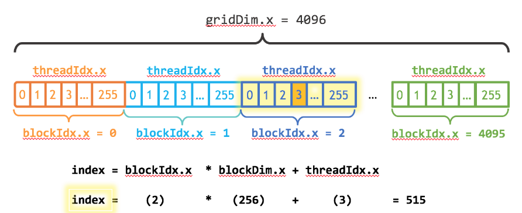
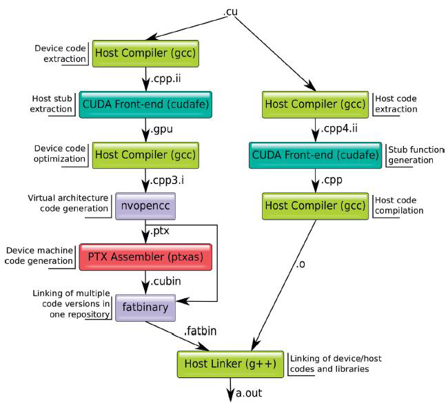
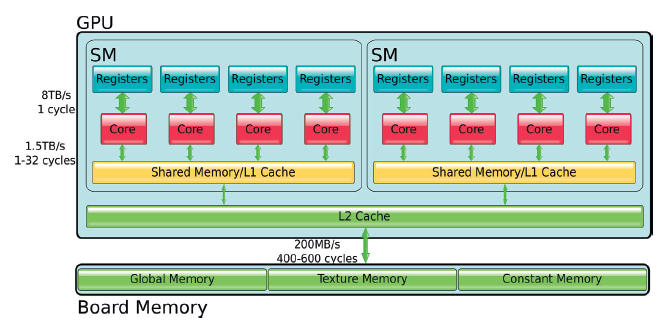

## Universidad Nacional de Colombia  
### Facultad de Ingeniería  
### Computación Paralela y Distribuida  
**Profesor**: Óscar Agudelo R.  

#### Control de Lectura: GPU y CUDA

#### Nombre del estudiante: Gabriel Andres Anzola Tachak

---

### PARTE I: Con base en el contenido del texto “An Even Easier Introduction to CUDA”

#### 1. ¿Qué es CUDA ToolKit?
CUDA ToolKit es un entorno de desarrollo que permite la creación de aplicaciones aceleradas por GPU de alto rendimiento. Incluye bibliotecas aceleradas por GPU, herramientas de depuración y optimización, compiladores para C/C++, y una biblioteca de tiempo de ejecución.

---

#### 2. ¿Qué indica el especificador __global__ en el código?
```cpp
// CUDA Kernel function to add the elements of two arrays on the GPU
__global__
void add(int n, float *x, float *y)
{
    for (int i = 0; i < n; i++)
        y[i] = x[i] + y[i];
}
```
El especificador `__global__` indica que la función será ejecutada en el dispositivo (GPU) y puede ser llamada desde el host (CPU). Las funciones declaradas con `__global__` se conocen como kernels.

---

#### 3. ¿Para qué sirve la función cudaMallocManaged()?
`cudaMallocManaged()` permite asignar memoria unificada, accesible tanto por la CPU como por la GPU. Esto simplifica la gestión de memoria, ya que ambas partes pueden acceder a los mismos datos.

---

#### 4. ¿Qué indica la sintaxis de triple paréntesis angular <<< >>> en CUDA?
La sintaxis `<<< >>>` especifica la configuración de ejecución de un kernel en CUDA. Dentro de los paréntesis se indica el número de bloques y el número de hilos por bloque que se utilizarán en el lanzamiento del kernel.

---

#### 5. ¿Para qué sirve la función cudaDeviceSynchronize()?
`cudaDeviceSynchronize()` asegura que la CPU espere hasta que la GPU haya terminado de ejecutar todas las operaciones previas, sincronizando así la ejecución entre CPU y GPU.

---

#### 6. ¿Para qué se utiliza el comando nvcc?
`nvcc` es el compilador de CUDA que permite compilar código tanto para la CPU como para la GPU. Es esencial para compilar programas que utilizan CUDA.

---

#### 7. ¿Para qué se utiliza el comando nvprof?
`nvprof` es una herramienta de perfilado que se utiliza para medir el rendimiento de las aplicaciones CUDA. Permite analizar el tiempo que toma cada kernel ejecutado en la GPU.

---

#### 8. ¿Para qué sirve la configuración de ejecución en CUDA (execution configuration)?
La configuración de ejecución define cómo se distribuyen los hilos entre los bloques y cómo estos bloques se distribuyen en la cuadrícula para ejecutar un kernel. Es fundamental para la paralelización eficiente en CUDA.

---

#### 9. ¿Para qué se utilizan threadIdx.x y blockDim.x en CUDA?
`threadIdx.x` es el índice del hilo dentro de su bloque, mientras que `blockDim.x` indica el número de hilos en un bloque. Juntos, permiten a cada hilo identificar su posición en la cuadrícula para procesar partes diferentes de los datos.

---

#### 10. ¿Qué son los multiprocesadores de secuencia (SMs) en las GPUs de CUDA?
Los Streaming Multiprocessors (SMs) son unidades de procesamiento dentro de la GPU que ejecutan los kernels de CUDA. Cada SM puede manejar múltiples hilos simultáneamente, dividiendo la carga de trabajo.

---

#### 11. Describa la jerarquía de hilos en CUDA utilizando como referencia la siguiente **imagen**.

En CUDA, los hilos están organizados en bloques, y los bloques se agrupan en una cuadrícula. Cada hilo tiene un índice único dentro de su bloque (`threadIdx.x`), y los bloques tienen su propio índice (`blockIdx.x`), lo que permite paralelizar la ejecución de manera efectiva.

---

#### 12. Utilizando el código mostrado a continuación, describa las características que tiene un kernel CUDA del tipo “grid-stride loop”?
```cpp
__global__
void add(int n, float *x, float *y)
{
    int index = blockIdx.x * blockDim.x + threadIdx.x;
    int stride = blockDim.x * gridDim.x;
    for (int i = index; i < n; i += stride)
        y[i] = x[i] + y[i];
}
```
Un "grid-stride loop" es un patrón de programación en CUDA que permite a cada hilo procesar múltiples elementos de un conjunto de datos. Se utiliza para mejorar el rendimiento en situaciones donde la cantidad de trabajo por hilo es mayor que el número de hilos disponibles.

---

### PARTE II: Con base en el capítulo 1 del libro "Multicore and GPU Programming, An Integrated Approach"

#### 1. Describir la taxonomía extendida de Flynn para computación paralela.
La taxonomía de Flynn extiende la clasificación de los sistemas de computación paralela en cuatro categorías: SISD, SIMD, MISD, y MIMD, añadiendo distinciones relacionadas con las arquitecturas de memoria y los modelos de coherencia.

---

#### 2. Fechas de liberación de las arquitecturas Nvidia Kepler, Maxwell, Pascal, Volta y Turing.
- Kepler: 2012  
- Maxwell: 2014  
- Pascal: 2016  
- Volta: 2017  
- Turing: 2018.

---

#### 3. Traducción del texto sobre el desarrollo de una solución paralela.
> El desarrollo de una solución paralela para un problema comienza con el desarrollo de su variante secuencial. ¡Esto puede parecer una contradicción, pero intenta responder estas preguntas: ¿Cómo podemos saber cuán más rápida es una solución paralela si no tenemos una solución secuencial con la cual compararla? Necesitamos una línea base, y esto solo se puede obtener a partir de una solución secuencial. Además, ¿cómo podemos verificar si la solución producida por el programa paralelo es correcta? No es que el resultado de un programa secuencial esté garantizado a ser correcto, pero es mucho más fácil lograr que lo sea.

> El desarrollo del algoritmo secuencial y su programa asociado también puede proporcionar información esencial sobre el diseño que se debe seguir para la paralelización.

> La cuestión es práctica, ya que necesitamos responder a las siguientes preguntas relacionadas con la viabilidad y la rentabilidad del programa paralelo:

> ¿Cuáles son las partes más intensivas en tiempo del programa? Estas deberían ser los principales candidatos para la ejecución paralela.
> Una vez que se identifican estas partes y suponiendo que se pueden paralelizar, ¿cuánto incremento de rendimiento se puede esperar?
> Se necesita una aclaración aquí: El programa secuencial requerido no es cualquier programa secuencial que resuelva el mismo problema. Debe ser la implementación secuencial del mismo algoritmo que se está paralelizando. Por ejemplo, si necesitamos ordenar datos en paralelo, un algoritmo adecuado para una implementación paralela es el "bucket sort". Una implementación secuencial de "bucket sort" puede ayudarnos a predecir el rendimiento paralelo y también identificar las partes más intensivas en tiempo del algoritmo. Una implementación secuencial de "quicksort" puede proporcionar información de rendimiento como referencia, pero no puede contribuir a responder ninguna de las dos preguntas planteadas anteriormente.

---

#### 4. ¿Para qué sirve un perfilador? ¿Cuáles son las dos técnicas más comunes para perfilar?
Un perfilador permite identificar las partes más lentas de un programa y medir el impacto de las optimizaciones paralelas. Las dos técnicas más comunes son el muestreo (sampling) y la instrumentación (instrumentation).

Las dos técnicas más comunes para perfilar son:

- Muestreo (Sampling): Esta técnica implica tomar muestras periódicas de la ejecución del programa para identificar las partes del código que consumen más tiempo o recursos. Es menos intrusiva y tiene un impacto mínimo en el rendimiento del programa.

- Instrumentación (Instrumentation): Consiste en insertar instrucciones adicionales en el código para medir el tiempo y los recursos consumidos en funciones específicas. Aunque ofrece datos más detallados, puede afectar el rendimiento del programa debido a la sobrecarga introducida por el código adicional.

---

#### 5. ¿Sobre qué tratan las secciones 1.5.1 y 1.5.2?
La sección 1.5.1 discute las arquitecturas de memoria en sistemas paralelos, mientras que la 1.5.2 trata sobre la coherencia de cachés en sistemas de computación paralela.

---

### PARTE III: Con base en el capítulo 6 del libro "Multicore and GPU Programming, An Integrated Approach"

#### 1. Traducción del párrafo sobre el despliegue de programas en GPUs.
> La implementación de programas en GPU tiene una característica que puede considerarse un obstáculo importante: las memorias de la GPU y del host suelen estar separadas, lo que requiere una transferencia explícita (o implícita, dependiendo de la plataforma de desarrollo) de datos entre ambas. Solo algunos sistemas de bajo costo y nivel de entrada violan esta regla, al tener una parte de la memoria principal asignada para fines de visualización y GPU a expensas del rendimiento, ya que la CPU y la GPU compiten por el acceso a la memoria.

---

#### 2. Lista de las principales plataformas de desarrollo para GPU.
- CUDA
- OpenCL
- DirectCompute
- Vulkan
- HIP

---

#### 3. Diferencia entre los patrones Globally Parallel, Locally Sequential y Globally Sequential, Locally Parallel.
El primero implica que la paralelización ocurre globalmente, mientras que el segundo implica que la ejecución secuencial ocurre globalmente, pero con paralelización local dentro de las unidades de procesamiento.

---

#### 4. Relación entre CUDA y el patrón Globally Sequential Locally Parallel.
CUDA sigue este patrón al ejecutar código secuencialmente en el host y paralelizar las operaciones en la GPU.

---

#### 5. Descripción de las filas de la tabla 6.1 (página 395).
La tabla describe los diferentes tipos de memoria en arquitecturas CUDA y su uso en operaciones paralelas.

---

#### 6. Puntos principales del código (listing 6.1).
```cpp
// File: hello.cu
#include <stdio.h>
#include <cuda.h>

__global__ void hello()
{
    printf("Hello world\n");
}

int main()
{
    hello <<<1 ,10>>>();
    cudaDeviceSynchronize();
    return 1;
}
```
El código imprime "Hello world" desde la GPU utilizando una configuración de ejecución simple con un solo bloque de hilos.

---

#### 7. ¿Qué calcula la expresión del código (listing 6.2)?
```cpp
int myID = (blockIdx.z ∗ gridDim.x ∗ gridDim.y +
            blockIdx.y ∗ gridDim.x +
            blockIdx.x ) ∗ blockDim.x ∗ blockDim.y ∗ blockDim.z +
            threadIdx.z ∗ blockDim.x ∗ blockDim.y +
            threadIdx.y ∗ blockDim.x +
            threadIdx.x;
````


La expresión calcula el identificador único de un hilo en un entorno tridimensional, tomando en cuenta los índices del bloque y del hilo dentro del bloque.

---

#### 8. Traducción de los párrafos sobre los núcleos de GPU.
> Los núcleos de la GPU son esencialmente unidades de procesamiento vectorial, capaces de aplicar la misma instrucción a una gran colección de operandos. Así que, cuando un kernel se ejecuta en un núcleo de GPU, la misma secuencia de instrucciones se ejecuta de manera síncrona por una gran colección de unidades de procesamiento llamadas procesadores de flujo, o SPs. Un grupo de SPs que se ejecutan bajo el control de una única unidad de control se llama multiprocesador de flujo, o SM. Una GPU puede contener múltiples SMs, cada uno ejecutando su propio kernel. Dado que cada hilo se ejecuta en su propio SP, nos referiremos a los SPs como núcleos (la documentación de Nvidia los llama núcleos CUDA), aunque un enfoque más purista sería tratar a los SMs como núcleos.

> Nvidia llama a este modelo de ejecución Single-Instruction, Multiple Threads (SIMT). SIMT es análogo a SIMD. La única diferencia importante es que en SIMT el tamaño del “vector” sobre el que operan los elementos de procesamiento está determinado por el software, es decir, el tamaño del bloque.

---

#### 9. ¿Qué es un Warp en CUDA?
Un warp es un grupo de 32 hilos que se ejecutan en paralelo en una GPU. Todos los hilos dentro de un warp ejecutan la misma instrucción al mismo tiempo.

---

#### 10. Utilizando la siguiente figura:

- Describa de forma breve el proceso de compilación de programa completo (whole-program) en CUDA.
    
    La compilación completa en CUDA involucra compilar todo el código, mientras que la compilación separada permite compilar módulos individuales, lo que facilita el desarrollo en proyectos grandes.
- ¿Qué diferencia el proceso de compilación separada (separate compilation) de los módulos del código del dispositivo (código para la GPU) de la compilación del programa completo (whole-program)?

    - La **compilación separada** permite compilar los módulos de código de GPU por separado, lo que facilita el desarrollo de grandes proyectos, ya que solo se recompilan los módulos modificados.
    
    - La **compilación del programa completo** compila todo el código en una sola etapa, lo que puede ofrecer mejores optimizaciones, pero requiere más tiempo al recompilar todo el programa cada vez que hay cambios.


---

#### 11. Funciones malloc, calloc, cudaMalloc y cudaFree.
`malloc` y `calloc` se utilizan para asignar memoria en la CPU, mientras que `cudaMalloc` y `cudaFree` son funciones de CUDA para gestionar memoria en la GPU.

---

#### 12. Tipos de memoria en CUDA.

- **Memoria/registros locales**: Memoria específica de cada hilo.
- **Memoria compartida**: Memoria que puede ser utilizada por todos los hilos en un bloque.
- **Memoria constante**: Memoria de solo lectura accesible por todos los hilos.
- **Memoria de textura y superficie**: Memorias especializadas optimizadas para ciertas operaciones gráficas.

---
